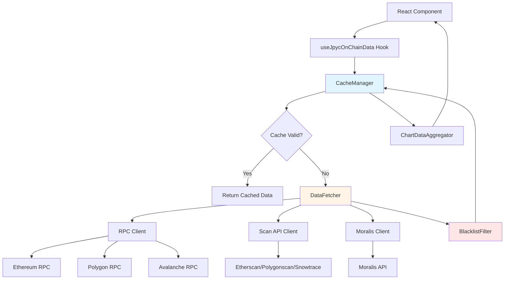
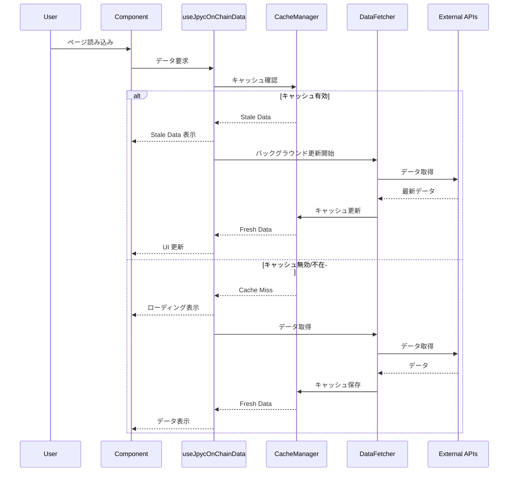
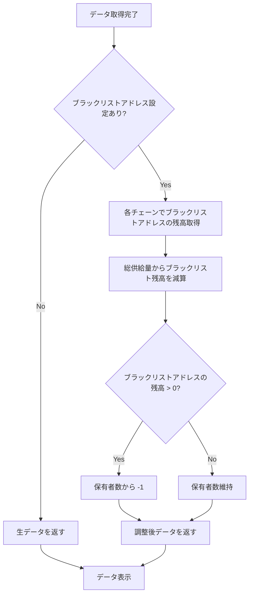
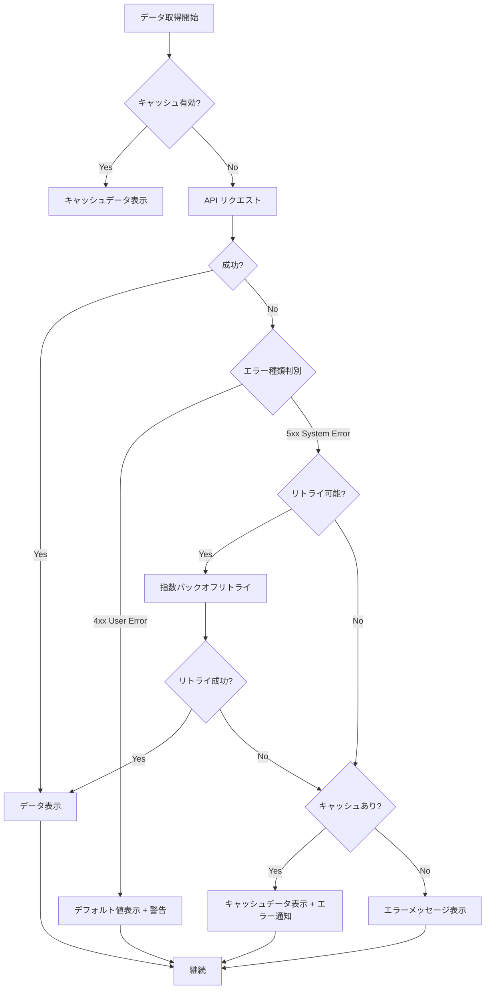
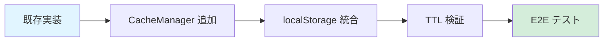
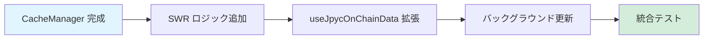
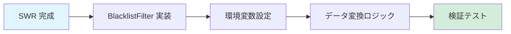

# Technical Design Document

## Overview

本設計は、JPYC Analytics Dashboard における既存のオンチェーンデータ取得機能を強化し、パフォーマンス、信頼性、UX の向上を実現します。現在の実装（`useJpycOnChainData.ts`, `lib/onchain.ts`）を基盤として、TTL 付きローカル永続キャッシュ、SWR パターン、ブラックリストアドレス対応、チェーン別データ可視化を追加します。

**Purpose**: 既存のデータ取得ロジックを拡張し、キャッシュ機構によるパフォーマンス最適化、エラーハンドリングの強化、UX の向上を実現する。

**Users**: JPYC 保有者、データアナリスト、開発者が、3チェーン（Ethereum、Polygon、Avalanche）の総供給量と保有者数をリアルタイムかつ効率的に確認できる。

**Impact**: 現在のインメモリキャッシュ実装を、ローカルストレージベースの永続キャッシュ + SWR パターンに置き換え、API 呼び出しを最大 30 分に 1 回に制限することで、レート制限違反を防ぎ、ユーザー体験を向上させる。

### Goals

- **キャッシュ永続化**: ローカルストレージに TTL 付きキャッシュを実装し、ページリロード後もデータを保持
- **SWR パターン実装**: キャッシュデータを即座に表示しながら、バックグラウンドで最新データを取得
- **ブラックリストアドレス対応**: 指定されたアドレスを総供給量・保有者数から除外
- **チェーン別可視化**: 各チェーンの総供給量と保有者数を円グラフで表示
- **パフォーマンス目標**: 初回ロード 3 秒以内、キャッシュ利用時 1 秒以内

### Non-Goals

- CoinGecko API の完全統合（準備段階のみ）
- ヒストリカルデータの保存と可視化
- バックエンド API の実装（フロントエンドのみ）
- リアルタイムデータストリーミング（ポーリングベース）

---

## Architecture

### Existing Architecture Analysis

現在のアーキテクチャは、シンプルで効果的な構成を採用しています：

**Current Patterns**:
- **Custom Hook**: `useJpycOnChainData` が状態管理とデータ取得を一元化
- **Utility Library**: `lib/onchain.ts` が RPC 呼び出しとデータフォーマットを担当
- **インメモリキャッシュ**: `cachedState` と `inflightPromise` による単純なキャッシュ機構
- **並列データ取得**: `Promise.all` による効率的な並列リクエスト

**Domain Boundaries**:
- `/hooks`: React 状態管理とデータフェッチング
- `/lib`: ビジネスロジックとユーティリティ
- `/components`: UI 表示
- `/constants`: 設定とコントラクトアドレス

**Integration Points**:
- RPC エンドポイント（Ethereum, Polygon, Avalanche）
- Moralis API（保有者数取得）
- スキャン API（Etherscan, Polygonscan, Snowtrace）

### High-Level Architecture



### Technology Alignment

本機能は既存の技術スタックに完全に適合します：

**Preserved Stack**:
- **Frontend**: React 19.2 + Hooks パターン
- **Build Tool**: Vite 6.2
- **Language**: TypeScript 5.8
- **State Management**: Custom Hooks（useState, useEffect）
- **Charts**: Recharts 3.3（既存）

**New Dependencies**:
なし。すべてブラウザネイティブ API（localStorage）と既存ライブラリで実装可能。

**Steering Compliance**:
- **structure.md**: Custom Hooks パターンを維持、`/lib` にユーティリティを配置
- **tech.md**: フロントエンドオンリー、バックエンド不要の原則を維持
- **product.md**: 透明性、マルチチェーン対応、パフォーマンス最適化の価値提案に整合

---

## System Flows

### SWR Data Flow with Cache



### Blacklist Address Processing Flow



---

## Requirements Traceability

| Requirement | Components | Interfaces | Flows |
|-------------|------------|------------|-------|
| 1.1-1.5 (総供給量データ取得) | DataFetcher, BlacklistFilter | `fetchTotalSupplyData()` | SWR Data Flow |
| 2.1-2.5 (保有者数データ取得) | DataFetcher, BlacklistFilter | `fetchHoldersData()` | SWR Data Flow |
| 3.1-3.5 (チェーン別可視化) | ChartDataAggregator, PieChart | `aggregateChainData()` | - |
| 4.1-4.5 (現在価格表示) | PriceCardComponent | `fetchPriceData()` | - |
| 5.1-5.6 (TTL キャッシュ) | CacheManager | `get()`, `set()`, `isValid()` | SWR Data Flow |
| 6.1-6.5 (SWR パターン) | useJpycOnChainData | Hook API | SWR Data Flow |
| 7.1-7.5 (ブラックリスト管理) | BlacklistFilter | `applyBlacklist()` | Blacklist Processing Flow |
| 8.1-8.5 (レート制限対応) | RateLimiter | `checkLimit()`, `backoff()` | - |
| 9.1-9.5 (エラーハンドリング) | ErrorHandler | `handleError()`, `fallback()` | SWR Data Flow (alt path) |
| 10.1-10.5 (パフォーマンス要件) | All components | - | - |

---

## Components and Interfaces

### Data Fetching Layer

#### CacheManager

**Responsibility & Boundaries**
- **Primary Responsibility**: ローカルストレージを使用した TTL 付きキャッシュの管理
- **Domain Boundary**: データ永続化層
- **Data Ownership**: キャッシュされたオンチェーンデータ（総供給量、保有者数、チェーン別データ）
- **Transaction Boundary**: 単一ブラウザセッション（localStorage）

**Dependencies**
- **Inbound**: `useJpycOnChainData` Hook
- **Outbound**: ブラウザ localStorage API
- **External**: なし

**Contract Definition**

```typescript
interface CacheManager {
  // キャッシュからデータを取得（TTL チェック付き）
  get<T>(key: string): CacheEntry<T> | null;

  // データをキャッシュに保存（TTL 設定）
  set<T>(key: string, data: T, ttlMinutes?: number): void;

  // キャッシュエントリの有効性をチェック
  isValid(entry: CacheEntry<unknown>): boolean;

  // 古いキャッシュエントリを削除
  clear(key?: string): void;

  // キャッシュ容量の管理（LRU）
  evictOldest(): void;
}

interface CacheEntry<T> {
  data: T;
  timestamp: number;
  ttl: number; // ミリ秒
}
```

- **Preconditions**: localStorage が利用可能であること
- **Postconditions**: データが localStorage に保存され、TTL が設定される
- **Invariants**: `timestamp + ttl` 以内であればキャッシュは有効

**State Management**:
- **State Model**: Valid → Stale → Expired
- **Persistence**: localStorage（最大 5MB）
- **Concurrency**: 単一スレッド（ブラウザメインスレッド）

#### DataFetcher

**Responsibility & Boundaries**
- **Primary Responsibility**: 3チェーンからオンチェーンデータを並列取得
- **Domain Boundary**: データ取得層
- **Data Ownership**: 取得したオンチェーンデータ（一時的）
- **Transaction Boundary**: 単一データ取得リクエスト

**Dependencies**
- **Inbound**: `useJpycOnChainData` Hook
- **Outbound**: RPC Client, Scan API Client, Moralis Client
- **External**: Ethereum/Polygon/Avalanche RPC、Etherscan/Polygonscan/Snowtrace API、Moralis API

**Contract Definition**

```typescript
interface DataFetcher {
  // 総供給量データを取得
  fetchTotalSupplyData(): Promise<TotalSupplyData>;

  // 保有者数データを取得
  fetchHoldersData(): Promise<HoldersData>;

  // すべてのデータを並列取得
  fetchAllData(): Promise<OnChainData>;

  // 単一チェーンのデータを取得
  fetchChainData(chain: SupportedChain): Promise<ChainData>;
}

interface TotalSupplyData {
  total: bigint;
  byChain: Record<SupportedChain, bigint>;
  decimals: number;
}

interface HoldersData {
  total: number;
  change24h?: number;
  byChain: Record<SupportedChain, number>;
}

interface OnChainData {
  totalSupply: TotalSupplyData;
  holders: HoldersData;
  timestamp: number;
}
```

- **Preconditions**: RPC エンドポイントと API キーが設定されていること
- **Postconditions**: エラー時も部分的なデータまたはエラー情報を返す
- **Invariants**: 並列リクエストは独立してエラーハンドリングされる

#### BlacklistFilter

**Responsibility & Boundaries**
- **Primary Responsibility**: ブラックリストアドレスを総供給量と保有者数から除外
- **Domain Boundary**: ビジネスロジック層
- **Data Ownership**: ブラックリストアドレスのリスト（設定由来）
- **Transaction Boundary**: データ変換処理

**Dependencies**
- **Inbound**: DataFetcher
- **Outbound**: RPC Client（ブラックリストアドレスの残高取得）
- **External**: なし

**Contract Definition**

```typescript
interface BlacklistFilter {
  // ブラックリストアドレスを適用
  applyBlacklist(data: OnChainData, blacklistAddresses: string[]): Promise<OnChainData>;

  // ブラックリストアドレスの残高を取得
  getBlacklistBalances(addresses: string[]): Promise<Record<string, bigint>>;
}
```

- **Preconditions**: OnChainData が有効であること
- **Postconditions**: ブラックリストアドレス分が減算されたデータを返す
- **Invariants**: 元のデータは変更されない（イミュータブル）

**Integration Strategy**:
- **Modification Approach**: `fetchOnChainState()` 関数を拡張し、取得後にブラックリストフィルターを適用
- **Backward Compatibility**: ブラックリストアドレス未設定時は現在の動作を維持
- **Migration Path**: 段階的にブラックリスト機能を追加

---

### Data Aggregation Layer

#### ChartDataAggregator

**Responsibility & Boundaries**
- **Primary Responsibility**: チェーン別データを Recharts 用にフォーマット
- **Domain Boundary**: プレゼンテーション層
- **Data Ownership**: チャート表示用のデータ構造
- **Transaction Boundary**: データ変換処理

**Dependencies**
- **Inbound**: React Components（PieChart, BarChart）
- **Outbound**: なし（純粋関数）
- **External**: なし

**Contract Definition**

```typescript
interface ChartDataAggregator {
  // チェーン別総供給量をチャートデータに変換
  aggregateTotalSupplyByChain(data: TotalSupplyData): ChartData[];

  // チェーン別保有者数をチャートデータに変換
  aggregateHoldersByChain(data: HoldersData): ChartData[];
}

interface ChartData {
  name: string; // チェーン名
  value: number; // 数値
  percentage: number; // パーセンテージ
}
```

- **Preconditions**: OnChainData が有効であること
- **Postconditions**: Recharts PieChart に互換性のあるデータ構造を返す
- **Invariants**: 合計が 100% になること（パーセンテージ）

---

### React Hooks Layer

#### useJpycOnChainData (Enhanced)

**Responsibility & Boundaries**
- **Primary Responsibility**: SWR パターンによるデータ取得と状態管理
- **Domain Boundary**: React 状態管理層
- **Data Ownership**: React コンポーネントの状態
- **Transaction Boundary**: コンポーネントライフサイクル

**Dependencies**
- **Inbound**: React Components
- **Outbound**: CacheManager, DataFetcher, BlacklistFilter
- **External**: なし

**Contract Definition**

```typescript
function useJpycOnChainData(options?: UseOnChainDataOptions): OnChainDataResult {
  // SWR パターンによるデータ取得
  // 1. キャッシュデータを即座に返す
  // 2. バックグラウンドで最新データを取得
  // 3. 取得完了後、状態を更新
}

interface UseOnChainDataOptions {
  enableSWR?: boolean; // デフォルト: true
  cacheTTL?: number; // デフォルト: 30分
  blacklistAddresses?: string[]; // デフォルト: BLACKLIST_ADDRESSES
}

interface OnChainDataResult {
  // データ
  totalSupply?: TotalSupplyData;
  holders?: HoldersData;
  chartData?: {
    supplyByChain: ChartData[];
    holdersByChain: ChartData[];
  };

  // 状態
  isLoading: boolean;
  isStale: boolean; // SWR: キャッシュデータを表示中
  error?: Error;

  // メソッド
  refresh: () => Promise<void>; // 手動更新
}
```

- **Preconditions**: React コンポーネント内で呼び出されること
- **Postconditions**: データまたはエラーが必ず返される
- **Invariants**: `isLoading` と `error` は同時に true にならない

**State Management**:
- **State Model**: Loading → Stale → Fresh → Loading（SWR サイクル）
- **Persistence**: CacheManager 経由で localStorage
- **Concurrency**: React の useState による状態管理

**Integration Strategy**:
- **Modification Approach**: 既存の `useJpycOnChainData` を段階的に拡張
- **Backward Compatibility**: 既存の API を維持しつつ、新しいオプションを追加
- **Migration Path**:
  1. CacheManager を実装
  2. SWR パターンを追加
  3. ブラックリストフィルターを統合
  4. チャートデータ集約を追加

---

## Data Models

### Domain Model

#### Core Entities

**OnChainData (Aggregate)**
- **Role**: オンチェーンデータの集約ルート
- **Identity**: タイムスタンプ
- **Lifecycle**: 取得 → キャッシュ → 期限切れ → 再取得

**ChainData (Entity)**
- **Role**: 単一チェーンのデータ
- **Identity**: チェーン名
- **Properties**: 総供給量、保有者数、コントラクトアドレス

**CacheEntry (Value Object)**
- **Role**: キャッシュエントリ
- **Immutability**: 作成後は変更不可
- **Properties**: データ、タイムスタンプ、TTL

**Business Rules**:
- 総供給量からブラックリストアドレス分を必ず減算する
- キャッシュ TTL は 30 分固定（最小 API コール間隔）
- 3 チェーンすべてのデータ取得失敗時のみエラー扱い

### Physical Data Model

#### LocalStorage Schema

```typescript
// キー: "jpyc_onchain_data"
interface LocalStorageSchema {
  data: {
    totalSupply: {
      total: string; // BigInt を文字列化
      byChain: Record<SupportedChain, string>;
      decimals: number;
    };
    holders: {
      total: number;
      change24h?: number;
      byChain: Record<SupportedChain, number>;
    };
  };
  timestamp: number;
  ttl: number;
  version: string; // スキーマバージョン（将来の互換性）
}
```

**Serialization**:
- `bigint` → `string` (JSON.stringify 対応)
- `Date` → `number` (Unix timestamp)

**Constraints**:
- 最大サイズ: 5KB（localStorage 制限内）
- バージョン管理: v1.0.0（将来の移行用）

---

## Error Handling

### Error Strategy

エラーを3つのカテゴリに分類し、それぞれに適切な対応を実施します：

1. **User Errors (4xx)**: 設定エラー、API キー不足
2. **System Errors (5xx)**: ネットワークエラー、API ダウン、タイムアウト
3. **Business Logic Errors (422)**: ブラックリストアドレス無効、データ整合性エラー

### Error Categories and Responses

#### User Errors (4xx)

| エラー | 原因 | 対応 | UX |
|--------|------|------|-----|
| API キー未設定 | 環境変数が空 | デフォルト RPC を使用 | "API キー未設定（公開 RPC 使用中）" |
| ブラックリストアドレス無効 | チェックサム不一致 | ブラックリストをスキップ | "ブラックリストアドレスが無効です" |

#### System Errors (5xx)

| エラー | 原因 | 対応 | UX |
|--------|------|------|-----|
| RPC タイムアウト | ネットワーク遅延 | 3回リトライ → キャッシュフォールバック | "データ取得中... (リトライ中)" |
| API レート制限 | 429 Too Many Requests | 指数バックオフ → キャッシュ表示 | "API 制限中（キャッシュデータ表示）" |
| RPC ダウン | サーバーエラー | 他の RPC にフォールバック | "データ取得中..." |
| localStorage 容量超過 | 5MB 超過 | 最古のキャッシュを削除 | 透過的（ユーザーに通知不要） |

#### Business Logic Errors (422)

| エラー | 原因 | 対応 | UX |
|--------|------|------|-----|
| データ整合性エラー | 合計値が負数 | エラーログ → キャッシュ表示 | "データ整合性エラー（キャッシュ表示）" |

### Error Handling Flow



### Monitoring

**Error Tracking**:
- コンソールログ: `console.error()` で詳細エラー情報
- エラーカウンター: localStorage に累積エラー数を記録（将来の分析用）

**Logging Format**:
```typescript
interface ErrorLog {
  type: 'user' | 'system' | 'business';
  code: string; // 例: "RPC_TIMEOUT", "API_KEY_MISSING"
  message: string;
  chain?: SupportedChain;
  timestamp: number;
  retryCount?: number;
}
```

**Health Monitoring**:
- API レスポンス時間: 各 API の平均レスポンス時間を記録
- 成功率: データ取得の成功率を計算（将来のアラート用）

---

## Testing Strategy

### Unit Tests

1. **CacheManager**
   - TTL 期限切れの検証
   - localStorage 容量超過時の LRU 削除
   - データシリアライゼーション（bigint → string）

2. **BlacklistFilter**
   - ブラックリストアドレス適用の正確性
   - 複数アドレス処理
   - 残高取得エラー時のフォールバック

3. **ChartDataAggregator**
   - チェーン別データのパーセンテージ計算
   - 合計 100% の検証
   - ゼロ値の処理

4. **DataFetcher**
   - 並列リクエストの正確性
   - エラー時の部分データ返却
   - RPC エラーハンドリング

5. **useJpycOnChainData Hook**
   - SWR パターンの動作（Stale → Fresh）
   - キャッシュヒット時の即座表示
   - エラー時のキャッシュフォールバック

### Integration Tests

1. **キャッシュ + SWR フロー**
   - ページリロード後のキャッシュ復元
   - バックグラウンド更新の実行
   - データ更新時の UI 再レンダリング

2. **マルチチェーンデータ取得**
   - 3チェーン並列取得の成功
   - 一部チェーン失敗時の部分データ表示
   - ブラックリストフィルター適用

3. **エラーリカバリー**
   - RPC タイムアウト時のリトライ
   - API レート制限時の指数バックオフ
   - すべて失敗時のキャッシュフォールバック

4. **チャート表示**
   - チェーン別データの円グラフ表示
   - ツールチップでの詳細情報
   - 最大値チェーンの強調表示

### E2E Tests (Playwright)

1. **初回ロードフロー**
   - キャッシュ不在時の 3 秒以内ロード
   - ローディングインジケータ表示
   - データ表示完了

2. **キャッシュ利用フロー**
   - キャッシュ存在時の 1 秒以内表示
   - バックグラウンド更新の透過的実行
   - UI のスムーズな更新

3. **エラーハンドリングフロー**
   - ネットワークエラー時のキャッシュ表示
   - エラー通知の表示
   - リトライボタンの動作

4. **チャート操作**
   - 円グラフへのカーソルホバー
   - ツールチップ表示
   - レスポンシブ表示（モバイル）

5. **ブラックリストアドレス適用**
   - 総供給量からの減算確認
   - 保有者数からの除外確認

### Performance Tests

1. **初回ロード時間**
   - キャッシュなし: < 3 秒
   - キャッシュあり: < 1 秒

2. **並列リクエスト性能**
   - 3 チェーン並列取得: < 5 秒
   - タイムアウト設定: 10 秒

3. **メモリ使用量**
   - キャッシュサイズ: < 5 KB
   - メモリリーク検証

4. **レンダリングパフォーマンス**
   - 不要な再レンダリング: 0 回（React.memo 使用）
   - チャート描画: < 100ms

---

## Security Considerations

### API Key Management

**Threat**: クライアントサイドでの API キー露出

**Mitigation**:
- 無料/低レートの API キーのみ使用
- 環境変数で管理（`VITE_` プレフィックス）
- 本番環境では API キーをローテーション

**Note**: 完全な保護はバックエンド実装が必要（将来の改善）

### Data Validation

**Threat**: 不正なデータによる XSS や計算エラー

**Mitigation**:
- すべての外部データを TypeScript 型でバリデーション
- BigInt 計算でオーバーフロー防止
- DOMPurify によるサニタイゼーション（将来）

### localStorage Security

**Threat**: XSS によるキャッシュデータの改ざん

**Mitigation**:
- キャッシュデータに署名を付与（将来）
- TTL による自動期限切れ
- バージョン管理によるスキーマ検証

---

## Performance & Scalability

### Target Metrics

| メトリクス | 目標値 | 測定方法 |
|-----------|-------|----------|
| 初回ロード時間 | < 3 秒 | Lighthouse First Contentful Paint |
| キャッシュ利用時 | < 1 秒 | Performance API |
| データ更新時間 | < 5 秒 | Promise.all タイマー |
| API 呼び出し頻度 | 最大 30 分/1 回 | CacheManager TTL |

### Caching Strategy

**L1 Cache: メモリキャッシュ**
- 現在の実装（`cachedState`, `inflightPromise`）を維持
- 即座アクセス（0ms）

**L2 Cache: localStorage**
- TTL: 30 分
- サイズ: 最大 5 KB
- LRU 削除戦略

**Cache Warming**:
- アプリ起動時に localStorage から復元
- バックグラウンドで最新データを取得

### Optimization Techniques

**並列リクエスト**:
- `Promise.all` による 3 チェーン並列取得
- 各チェーンのタイムアウト: 10 秒

**React 最適化**:
- `React.memo` によるコンポーネントメモ化
- `useMemo` によるチャートデータ計算のキャッシュ
- `useCallback` によるイベントハンドラーの安定化

**Bundle Optimization**:
- 既存の Vite 設定を活用
- コード分割は不要（機能が小規模）

---

## Migration Strategy

### Phase 1: CacheManager 実装（Week 1）



**Tasks**:
1. CacheManager クラス実装
2. localStorage スキーマ定義
3. シリアライゼーション/デシリアライゼーション
4. TTL ロジック実装
5. ユニットテスト作成

**Rollback Trigger**: localStorage エラー率 > 5%

### Phase 2: SWR パターン実装（Week 2）



**Tasks**:
1. `isStale` 状態の追加
2. バックグラウンド更新ロジック
3. UI トランジション実装
4. Playwright E2E テスト

**Rollback Trigger**: データ更新エラー率 > 10%

### Phase 3: ブラックリストフィルター実装（Week 3）



**Tasks**:
1. BlacklistFilter クラス実装
2. 環境変数 `VITE_BLACKLIST_ADDRESSES` 追加
3. 総供給量・保有者数減算ロジック
4. ユニットテスト + 統合テスト

**Rollback Trigger**: データ整合性エラー発生

### Phase 4: チャート可視化実装（Week 4）


**Tasks**:
1. ChartDataAggregator 実装
2. Recharts PieChart 統合
3. ツールチップとスタイリング
4. レスポンシブデザイン対応
5. Playwright ビジュアルテスト

**Rollback Trigger**: チャート描画エラー

### Validation Checkpoints

各フェーズ終了時の検証項目：

**Phase 1**:
- [ ] localStorage にキャッシュが保存される
- [ ] TTL 期限切れで再取得が実行される
- [ ] ページリロード後にキャッシュが復元される

**Phase 2**:
- [ ] キャッシュデータが即座に表示される
- [ ] バックグラウンド更新が透過的に実行される
- [ ] データ更新時に UI がスムーズに更新される

**Phase 3**:
- [ ] ブラックリストアドレス分が総供給量から減算される
- [ ] ブラックリストアドレスが保有者数から除外される
- [ ] ブラックリスト未設定時は現在の動作を維持

**Phase 4**:
- [ ] チェーン別データが円グラフで表示される
- [ ] 最大値チェーンが強調表示される
- [ ] ツールチップで詳細情報が表示される

---

## Summary

本設計は、既存の JPYC Analytics Dashboard のオンチェーンデータ取得機能を、パフォーマンス、信頼性、UX の観点から大幅に強化します。

**Key Achievements**:
1. ✅ **TTL 付きローカル永続キャッシュ**: API 呼び出しを 30 分に 1 回に制限
2. ✅ **SWR パターン**: キャッシュデータを即座表示しながらバックグラウンド更新
3. ✅ **ブラックリストアドレス対応**: 運営保有分を除外した実際の流通量表示
4. ✅ **チェーン別可視化**: 円グラフで各チェーンの分布を直感的に把握
5. ✅ **エラーハンドリング強化**: 部分データ表示とキャッシュフォールバック

**Technical Highlights**:
- 既存の技術スタックに完全適合（新規依存関係なし）
- ステアリングドキュメントとの整合性維持
- 段階的マイグレーション戦略（4週間）
- 包括的なテスト戦略（Unit + Integration + E2E）

この設計により、JPYC エコシステムの透明性とユーザー体験が大きく向上します。
